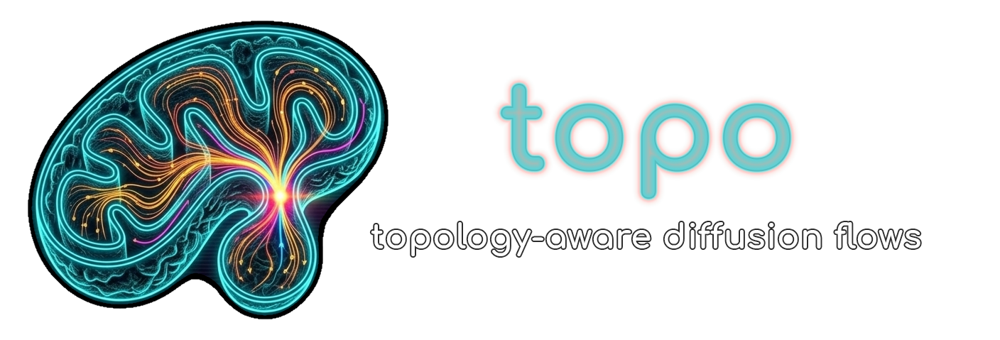
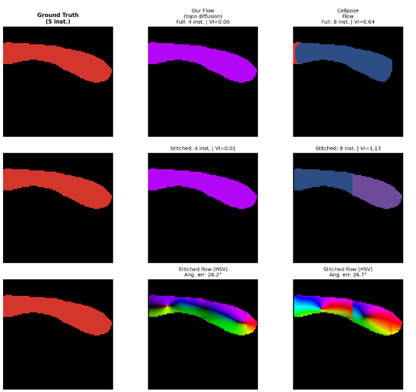

<p align="center">
  
</p>

<h1 align="center">topo</h1>
<p align="center"><b>Topology-aware diffusion-based flow field generation for 3D instance segmentation</b></p>

<p align="center">
  <a href="https://pypi.org/project/topo/"></a>
  <a href="https://pypi.org/project/topo/"></a>
  <a href="LICENSE"></a>
</p>

---

## Overview

**topo** generates 3D vector flow fields that point toward instance centers, enabling instance segmentation through particle tracking. It provides two strategies depending on object morphology:

- **Direct flows** — for convex shapes (nuclei, vesicles, etc.)
- **Diffusion flows** — topology-aware flows for non-convex shapes (mitochondria, cells)
<p align="center">

</p>

## Method

### Direct Flows

For convex objects, each foreground voxel $\mathbf{x}$ receives a unit vector pointing toward the center of mass $\mathbf{c}$ of its instance:

$$\mathbf{f}(\mathbf{x}) = \frac{\mathbf{c} - \mathbf{x}}{\|\mathbf{c} - \mathbf{x}\|}$$

At the center of mass itself (the *sink*), $\mathbf{f}(\mathbf{c}) = \mathbf{0}$.

### Diffusion Flows

For non-convex objects (e.g., mitochondria that curve back on themselves), direct vectors would cut through empty space. Instead, we solve the **heat equation** inside the object mask and take its gradient.

For each spatial axis $d \in \{z, y, x\}$, we initialize a scalar field $u_d$ with coordinate values inside the instance mask $\Omega$:

$$u_d(\mathbf{x}, t=0) = x_d \quad \forall\, \mathbf{x} \in \Omega$$

We then iteratively diffuse via the discrete Laplacian:

$$u_d^{(t+1)} = u_d^{(t)} + \frac{1}{6} \nabla^2 u_d^{(t)}$$

where $\nabla^2$ is the 6-connected 3D discrete Laplacian:

$$\nabla^2 u(\mathbf{x}) = \sum_{i=1}^{6} u(\mathbf{x}_i) - 6\, u(\mathbf{x})$$

with $\mathbf{x}_i$ being the 6 face-adjacent neighbors.

**Boundary conditions:**

| Region | Condition | Effect |
|---|---|---|
| True background ($\mathbf{x} \notin \Omega$, annotated) | Dirichlet: $u_d = 0$ | Flow points inward at real boundaries |
| Annotation boundary (unannotated region) | Neumann: $\frac{\partial u_d}{\partial \mathbf{n}} = 0$ | Free diffusion — cut instances don't pile up at crop edges |

After convergence, the flow field is the normalized gradient:

$$\mathbf{f}(\mathbf{x}) = \frac{\nabla \mathbf{u}(\mathbf{x})}{\|\nabla \mathbf{u}(\mathbf{x})\|}$$

where $\nabla \mathbf{u} = \left(\frac{\partial u_z}{\partial z},\, \frac{\partial u_y}{\partial y},\, \frac{\partial u_x}{\partial x}\right)$.

### Adaptive Iterations

The number of diffusion iterations scales with instance size:

$$n_{\text{iter}} = \min\!\left(\alpha \cdot \max(D_{\text{bbox}}, H_{\text{bbox}}, W_{\text{bbox}}),\; n_{\max}\right)$$

where $\alpha$ is the adaptive factor (default 6) and $n_{\max}$ is the iteration cap.

### Instance Recovery via Euler Integration

At inference, each foreground voxel is tracked through the predicted flow field using Euler integration:

$$\mathbf{x}^{(t+1)} = \mathbf{x}^{(t)} + s \cdot \mathbf{f}(\mathbf{x}^{(t)})$$

where $s$ is the step size. After $N$ steps, voxels that converge within a radius $r$ are clustered into the same instance.

## Install

```bash
pip install topo

# With GPU support (PyTorch):
pip install topo[gpu]
```

## Usage

```python
import numpy as np
from topo import generate_direct_flows, generate_diffusion_flows

# instance_mask: [D, H, W] int array where each unique ID is one instance
instance_mask = ...

# Direct flows (convex shapes)
flows = generate_direct_flows(instance_mask)  # [3, D, H, W]

# Diffusion flows (non-convex shapes)
flows = generate_diffusion_flows(instance_mask, n_iter=200)  # [3, D, H, W]
```

### Multi-class batch computation

```python
from topo import compute_flow_targets

# instance_ids: [N_classes, D, H, W] — one channel per class
flows, class_fg = compute_flow_targets(
    instance_ids,
    class_names=["nuc", "mito", "ves"],
    class_config={
        "nuc":  {"flow_type": "direct"},
        "mito": {"flow_type": "diffusion", "diffusion_iters": 200},
        "ves":  {"flow_type": "direct"},
    },
)
# flows:    [N*3, D, H, W] — per-class unit flow vectors
# class_fg: [N, D, H, W]   — per-class foreground masks
```

### GPU acceleration

```python
from topo.flow_gpu import compute_flow_targets_gpu

# instance_ids: [B, N, D, H, W] torch.Tensor on GPU
flows, class_fg = compute_flow_targets_gpu(instance_ids)
```

## License

MIT
